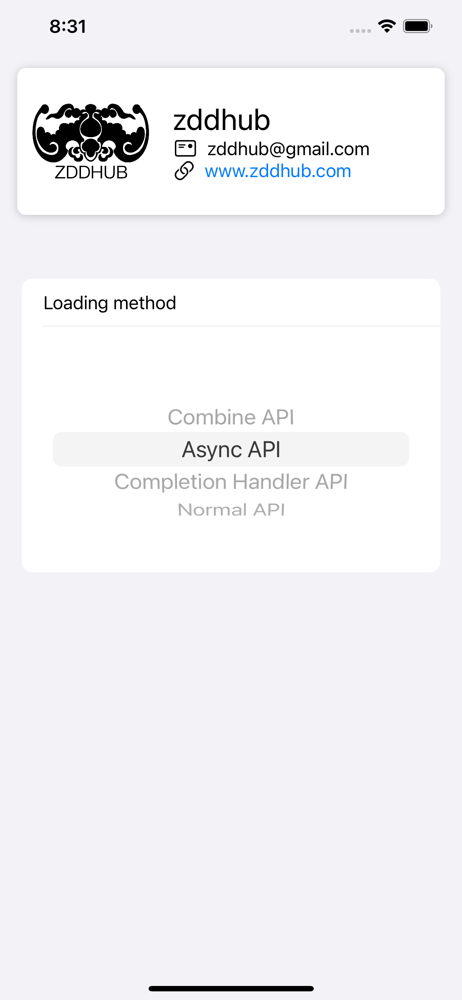
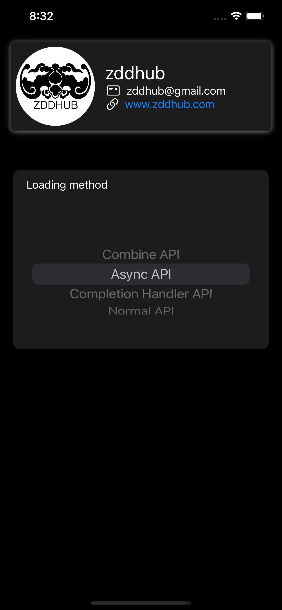

# url-loading-system

Explore [`URL Loading System`](https://developer.apple.com/documentation/foundation/url_loading_system).

Read article on [blog (cn)](https://zddhub.com/note/2022/05/04/url-loading-system.html)

## Screenshots

|Light Mode|Dark Mode|
|:-:|:-:|
|||

## API Overviews

*Notice: See above SVG image only on light mode, it can be zoomed in/out.*

### Type
| Task type                | Combine API | Async API | Completion Handler API | Normal API |
|:-|:-|:-|:-|:-|
|`URLSessionDataTask`      | ✅ | ✅ | ✅ | ✅ |
|`URLSessionUploadTask`    | - | ✅ | ✅ | ✅ |
|`URLSessionDownloadTask`  | - | ✅ | ✅ | ✅ |
|`URLSessionStreamTask`    | - | - | - | ✅ |
|`URLSessionWebSocketTask` | - | - | - | ✅ |

## Cheat Sheet

- [Combine API](./UrlLoadingSystem/LoadingMethod/CombineApi.swift)
- [Async API](./UrlLoadingSystem/LoadingMethod/AsyncApi.swift)
- [Completion Handler API](./UrlLoadingSystem/LoadingMethod/CompletionHandlerApi.swift)
- [Normal API](./UrlLoadingSystem/LoadingMethod/NormalApi.swift)
